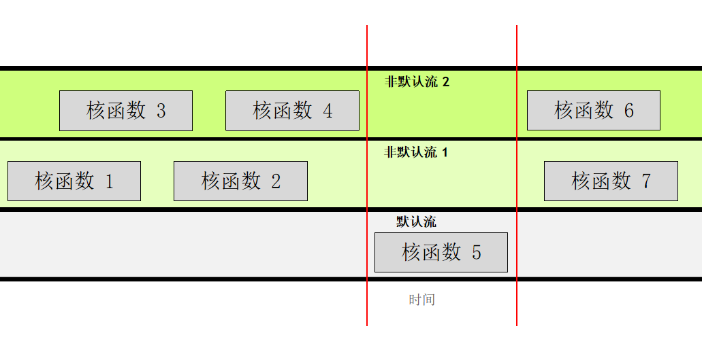

## CUDA编程

### CUDA概述

CUDA 提供一种可扩展 C、C++、Python 和 Fortran 等语言的编码范式

基于CUDA，通过对原生代码的轻微改动，就能方便地在NVIDIA的GPU 上运行大量经加速的并行代码，进而实现 CPU 和 GPU 组成的加速/异构系统。加速系统会运行 CPU 程序，并启动将受益于 GPU 大规模并行计算能力的函数。

此外CUDA还具有高度优化库生态系统，附带功能强大的 命令行和可视化分析器。

### 语法入门

CUDA文件拓展名为.cu，其兼容C++语法

```cpp
__global__ some_kernel(int N){  
 int idx = threadIdx.x + blockIdx.x * blockDim.x;
 a[idx]=1
}
int *a;
cudaMallocManaged(&a, size);

size_t threads_per_block = 1024;
size_t number_of_blocks = 32;
some_kernel<<<number_of_blocks, threads_per_block>>>(N);

cudaError_t err;
err = cudaGetLastError(); 
cudaFree(a);
cudaDeviceSynchronize();
```

- 函数设备域：

  函数的开头具有设备域，其中`__global__`指代函数可在GPU 上运行并可**全局**调用（包括CPU）

- 线程位置：

  block依次标序，而每个block的线程也各自从零开始标序，因而线程位置可以用以下公式表达

  `threadIdx.x + blockIdx.x * blockDim.x`

- 内存管理：

  函数运行的数据需要在对应设施的内存上（CPU/GPU）

  通过cuda的`cudaMallocManaged`、`cudaFree`可以方便地进行自动管理

- 核函数调用：

  需要在GPU上调用的函数，必须提供  `<<< ... >>> `语法完成的执行配置

  参数分别为`gridDim`, `blockDim`, `sharedMem`, `stream`

- 错误处理：

  许多 CUDA 函数会返回类型为`cudaError_t` 的值，可用于检查调用函数时是否发生错误。

  而对于核函数可以使用`cudaGetLastError`进行错误检查

- 进程同步：

  核函数启动方式为异步——<u>CPU 代码将继续执行</u>而无需等待核函数完成启动

  因此，需要采用`cudaDeviceSynchronize`函数，使得主机等待至核函数完成后继续执行程序

以上即cuda代码的核心内容，编译和运行 ` .cu `程序需要调用CUDA编译器`nvcc`，其逻辑类似gcc，编译举例如下

```
nvcc -arch=sm_70 -o out some-CUDA.cu -run
```

注意到`arch`表达该文件的架构类型，根据不同GPU需要填写不同内容

### 线程层次

#### 层次概述

每个线程在其线程块内部均会被分配一个索引，从0开始。此外，每个线程块也会被分配一个索引，并从0开始

线程会组成线程块，线程块又会组成网格，而网格是级别最高的层次实体

当数据集的大小规模大于网格线程时，可以通过类似

` for (int i = indexWithinTheGrid; i < N; i += gridStride)`

的方式跨网格循环遍历

#### 处理单元

 GPU 具有称为流多处理器（ SM）的处理单元，而SM会在一个名为warp的线程块内管理和执行包含 32 个线程的线程组

可以使用以下代码获取设备各个信息

```cpp
    // 获取当前设备 ID
    cudaGetDevice(&deviceId);
    // 获取设备属性
    cudaDeviceProp deviceProp;
    cudaGetDeviceProperties(&deviceProp, deviceId);
    // 提取所需的信息
    computeCapabilityMajor = deviceProp.major;
    computeCapabilityMinor = deviceProp.minor;
    multiProcessorCount = deviceProp.multiProcessorCount;//SM数量
    warpSize = deviceProp.warpSize;
```


一般块内线程大小不大于**1024**，而线程块建议为**SM的倍数**

#### 多维层次

网格和线程块定义最多具有 3 个维度，以方便形象化调用

可以使用 CUDA 的`dim3` 类型定义多维层次，如`dim3 threads_per_block(16, 16, 1)`

同时可以通过`  gridDim.x` 、 `gridDim.y` 、 `blockDim.x` 和  `blockDim.y`进行层次查询


### 并发操作

#### CUDA流

在 CUDA 编程中，流是由按顺序执行的一系列命令构成，核函数的执行以及一些内存传输均在 CUDA 流中进行

一般来说，CUDA代码会在默认流中执行，且会互相堵塞

通过控制不同流进行并发执行，可以避免堵塞，实现更多优化

```cpp
cudaStream_t stream;   // CUDA流的类型为 `cudaStream_t`
 cudaStreamCreate(&stream); // 注意，必须将一个*指针*传递给 `cudaCreateStream`
 someKernel<<<number_of_blocks, threads_per_block, 0, stream>>>();   // `stream` 作为第4个EC参数传递
cudaStreamDestroy(stream); // 注意，将*值*（而不是指针）传递给 `cudaDestroyStream`
```

CUDA流的运行有以下规则：

- 通过递交流参数（如执行配置第四项）启用非默认流，给定流中的所有操作会按序执行
- 就不同非默认流中的操作而言，无法保证其会按彼此之间的任何特定顺序执行
- 默认流具有阻断能力，它会等待其它已在运行的所有流<u>完成当前操作之后</u>才运行，但在其<u>自身运行完毕之前亦会阻碍</u>其它流的运行



#### 原子操作

为了避免线程对同一内存的读写冲突，CUDA提供了一些原子操作的函数

如`atomicAdd`、`atomicSub`、`atomicExch`、`atomicMin`

、`atomicMax`、`atomicInc`、`atomicDec`、`atomicCAS`等

同时还可以通过原子操作实现简单的内存锁

```cpp
__device__ void lock(int *mutex) {
    while (atomicCAS(mutex, 0, 1) != 0); // 用 atomicCAS 实现锁
}
__device__ void unlock(int *mutex) {
    atomicExch(mutex, 0); // 释放锁
}
__global__ void kernel_function(int *data, int *mutex) {
    int tid = threadIdx.x;
    lock(mutex);// 关键区：对共享数据的操作
    data[0] += tid;
    unlock(mutex); //当然，该操作可以通过atomicAdd(&data[0], tid)直接实现
}
```


### 内存分配

#### 统一内存（UM）

`cudaMallocManaged`所分配的统一内存可以实现自动内存迁移

但内存在不同设施的迁移仍会影响计算的效率，可以通过分析工具看查

当设备所需的内存不在该设备上时，访问内存时会发生*页错误*

可以通过内存规范和内存预取来减少这方面的开销

#### 共享内存

共享内存（Shared Memory）是 CUDA 提供的一种特殊的内存空间

位于每个线程块（Block）中，由同一块内的所有线程共享，具有低延迟高带宽的特点，可以显著提高性能

共享内存可以在内核函数中声明，使用 `__shared__` 修饰符

如果是静态分配，需要直接确认大小；如果是动态分配，需要前加`extern`标识，并由执行配置第三项传入内存大小

使用共享内存必须确保所有线程在访问共享内存之前已经完成了写入操作，可通过`__syncthreads()`实现同步

#### 异步内存预取

CUDA 可通过`cudaMemPrefetchAsync`函数，轻松将托管内存异步预取到 GPU 或 CPU

此举可以减少页错误和按需数据迁移所带来的成本，并进而提高 GPU 核函数和 CPU 函数的性能，其语法如下

```cpp
cudaMemPrefetchAsync(pointerToSomeUMData, size, deviceId); 
// Prefetch to GPU device.
 cudaMemPrefetchAsync(pointerToSomeUMData, size, cudaCpuDeviceId); 
// Prefetch to host. `cudaCpuDeviceId` is a built-in CUDA variable.
```

#### 手动内存管理

在已知只需在设备或主机上访问数据时，手动内存分配可以大幅简化内存迁移并避免自动按需迁移的开销

此外，手动内存管理可以使用非默认流同时开展数据传输与计算工作，进而提高速度

以下是一些用于手动内存管理的 CUDA 命令：

- `cudaMalloc(&device_a, size)` 命令将直接为处于活动状态的 **GPU** 分配内存，但是主机代码将无法访问该命令返回的指针。 
- `cudaMallocHost(&host_a, size)` 命令将直接为 CPU 分配内存
- `cudaFreeHost`和`cudaFree` 命令分别用于释放主机固定内存和设备内存 
- `cudaMemcpy(target_p, sourece_p, size, method) `命令可拷贝（而非传输）内存，无论是从主机到设备`cudaMemcpyHostToDevice`，还是从设备到主机`cudaMemcpyDeviceToHost`
- `cudaMemcpyAsync`，类似`cudaMemcpy`，但可以通过可选的第五个参数，传递非默认流，实现异步内存复制


### 加速优化

#### 性能分析

对于应用程序分析，可以使用CUDA提供的集成工具

- `nsys`：
  -  NVIDIA 的Nsight System命令行分析器，通过向其传递并运行nvcc编译的可执行文件即可自动分析
  - 可以打印出序 GPU 活动的摘要输出，分析核函数的调用与开销占比
  - 可以打印统一内存活动的相关信息
  - 分析命令如，`nsys profile --stats=true ./目标文件`
- `Nsight Systems`：
  - Nsight System的图形化界面，可以对`nsys`生成的报告进行可视化分析
  - 可以清楚地看到内存的传输操作与时间开销
  - 可以可视化地展示不同cuda流的运行

通过这些集成工具，可以方便找到需要的优化的地方

#### 常见优化思路

- 合适的核函数编写
  - 不能在核函数内调用核函数，且不要反复启用核函数，即应当把核函数放在for的外层
  - 尝试合适的线程块与线程，一般块内线程为32的倍数且不大于**1024**，而线程块建议为**SM的倍数**
  - 通过原子操作等方式避免数据竞争
- CUDA流的管理
  - 通过适量的CUDA流提高并发效率
  - 通过非默认流的异步内存转移提高效率
  - 注意流的同步来保证正确性
- 内存管理
  - 通过手动分配内存来提高内存读写，减少内存迁移
  - 通过共享内存分配加速线程内计算速度（高带宽低延时，但容量有限）

